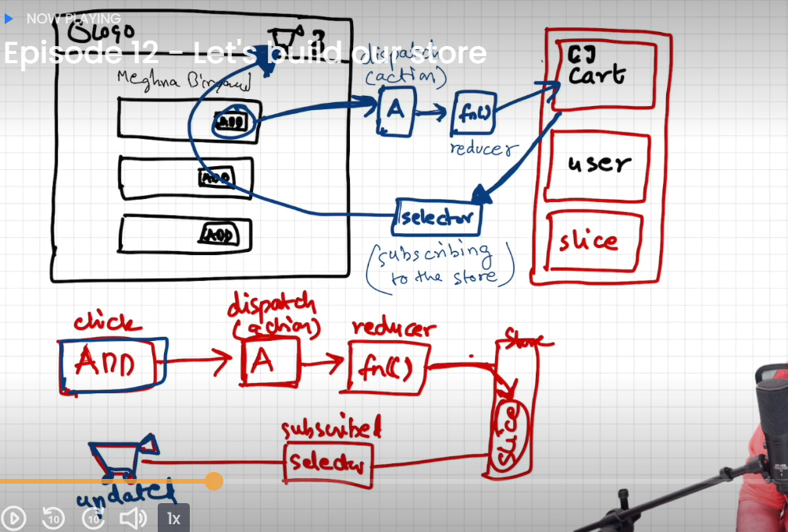

## Namaste React Course by Akshay Saini

# Chapter 12 - Let's build our store

## `useContext` vs `Redux` ?

A: `useContext` and `Redux` are two different `state management` solutions in React, and they serve different purposes.

`useContext:`

- useContext is builtin React hooks that allow to share context(data) within the components and subscribe the changes at component to get the updated results whenever it's updated.
- It best suited for that alpplication which required less number of shared data with less complexity among the components.
- `useContext` is simple and `lightweight`, it is good fit for simpler application, where ccentralized global state management is not necessary.
- It is particulary useful when you have small number of components that need access to shared data without the need for dedicated state management library.

`Redux:`

- Redux is a `state management` library that provides a `centralized store` to manage and share global application state to manage the data.
- It is suited for `large and complex application` which need data management extensively, such as application with large number of components with complex data flow requirements.

## Advantages of `Redux Toolkit` over `Redux`

A:

#### Issues with basic Redux:

- Configuring a Redux store is too complicated
- Have to add a lot of packages to build a large-scale application
- Redux requires too much boilerplate code which makes it cumbersome to write efficient and clean code.

#### Reasons for preferring RTK(Redux ToolKit):

- Redux ToolKit solves various issues by providing a hook-based implementation of Redux
- RTK gives the ability to write mutable state updates in the reducers.
- It also eliminates the use of extra coding by providing boilerplates.
- RTK also has the feature of RTK query which eliminates the use of Thunks and makes the query processing faster
- It also provides automatic support for Redux Dev-tools Extension and for immer.js library which is a great tool to deal with immutable objects.
- You can also use the various predefined functions of Redux Toolkit which not only speeds up the process but also saves time.

#### Dependencies Included with RTK(Redux ToolKit):

- immer
- redux
- redux-thunk
- reselect

## Explain `Dispatcher`.

A: dispatch is a `function` provided by the store that allows you to `send an action` to update the state of your application.
Example:

```
import { useDispatch } from "react-redux";
const dispatch = useDispatch();
<button onClick={() => dispatch(increment())}>Add</button>

```

## Explain `Reducer`.

A: Reducers are basically pure JS functions which take in the `previous state` and an `action` and return the newly updated state

## Explain `Slice`.

A: Slice contains all reducer logics and actions for a single feature
Example:

```
import { createSlice } from "@reduxjs/toolkit";

const counterSlice = createSlice({
  name: "counter",
  initialState: {
    count: 0
  },
  reducers: {
    increment: (state, action) => {
      state.count = state.count + 1;
    }
  }
});
export const { increment } = counterSlice.actions;
export default counterSlice.reducer;

```

## Explain `Selector`.

A: `Selector` is function which return data that is based on `state`, By help of `selector` we get the updated data changes at subscription level when `state` is changed inside the store, and this phenomena is known as `subscribing to store`.
Example:

```
import { useSelector } from "react-redux";
const count = useSelector((store) => store.app.count);

```

## Explain `createSlice` and the configuration it takes.

A: A function that accepts an initial state, an object of reducer functions, and a `slice name`, and automatically generates action creators and action types that correspond to the reducers and state.

Example:

```
import { createSlice } from '@reduxjs/toolkit'

const initialState = { value: 0 }

const counterSlice = createSlice({
  name: 'counter',
  initialState,
  reducers: {
    increment(state) {
      state.value++
    },
    decrement(state) {
      state.value--
    },
    incrementByAmount(state, action) {
      state.value += action.payload
    },
  },
})

export const { increment, decrement, incrementByAmount } = counterSlice.actions
export default counterSlice.reducer
```

## What is the difference in below syntax

```
  - onClick = {handleAddItem}
  - onClick = {() => handleAddItem(item)}
  - onClick = {handleAddItem(item)}
```

A:

- `onClick = {handleAddItem}` : Use onClick={handleAddItem} when you don't need to pass any additional data.

- `onClick = {() => handleAddItem(item)}`: Use onClick={() => handleAddItem(item)} when you need to pass additional data to the event handler.

- `onClick = {handleAddItem(item)}`: This code is not typically used for handling events in React, it would execute as soon as the component renders, not when the element is clicked

### Points noted from lecture 12.

- Redux is not mandatory

- Redux is separate library from react, it's not one on the same thing it's different in one another

- Zustand is another library for state management

- Redux offers eaiser to debug

- Redux Toolkit

- Redux store can have multiple slices(for example: cart, user etc) based on component logical requirements

#### To add item in redux store => dispatch(action) => () => {} this function is known as reducer

- `Write data in store`: When we click on add button it `dispatch (action)` which calls a `reducer` function and this `reducer function` updates our `slice store`.

-` Read data from store`: By help of selector and this selector fetch data at component level and this `phenomina` is known as `subscribing to store`

### For reference:



### Redux Toolkit

- Install @reduxjs/toolkit and react-redux
- BUild our store
- Connect our store to our app
- will create cart slice
- dispatch(action)
- selector

- `Remember`: In store we use one "Reducer" which can contain multiple slice of reducers, and in slice we use term 'Reducers', it means that it contain multiple reducer function

- inside the vanilla redux it gives strictly warning that don't mutate the state directly and it's mandatory to return the new state but in RTK it allow to mutute the state directly in reducers

- RKT uses immer behind the scene

- if want to read the state of RTK in console.log then it gives `proxy object` if want read it RTK provides `current` by this way we can read data in console.

## Home work

- play with redux plugin
- Go and read RTK query quick start => earlier we use middleware and thung to call the api and store in redux
  e.g:

```
console.log(current(state))
```

### Reference:

https://redux-toolkit.js.org/tutorials/rtk-query
https://immerjs.github.io/immer/
